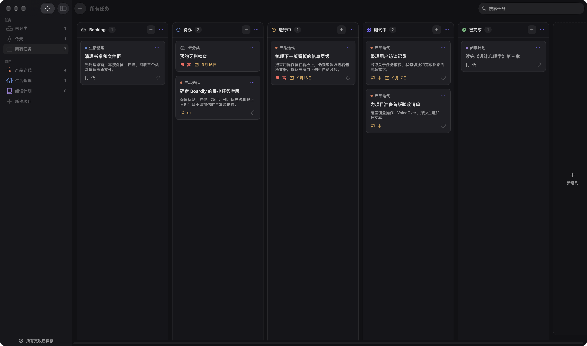
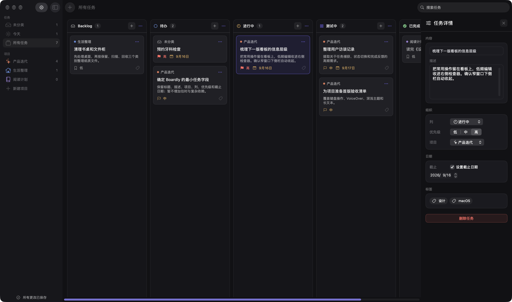
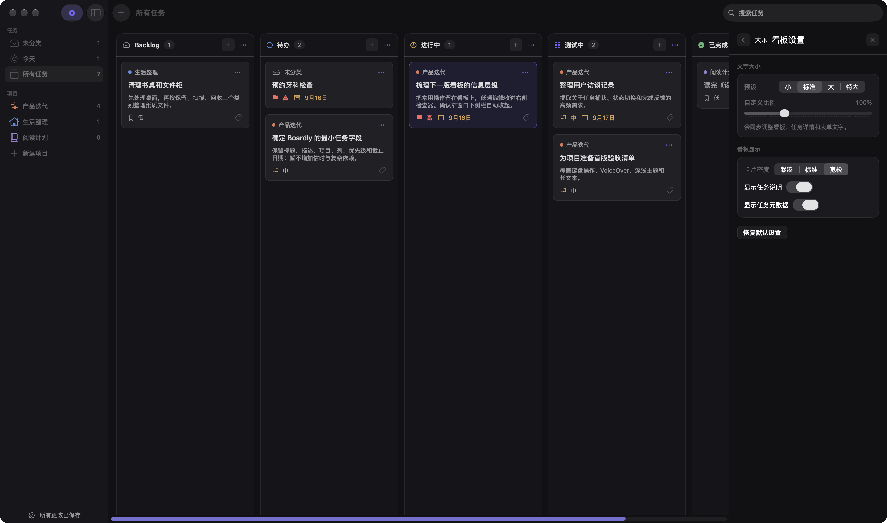

# Boardly


Boardly 是一个原生 macOS 个人待办看板，帮助你在一个安静、聚焦的深色工作区里完成任务捕获、排序、推进与复盘。

它使用 SwiftUI 构建，默认提供 Backlog、待办、进行中和已完成四列，并支持项目、搜索、任务详情 Inspector、原生拖放、键盘操作和本地 JSON 持久化。

> 当前仓库是一个可运行的产品原型，优先验证个人任务工作流与 macOS 原生交互，不包含团队协作、在线同步或 AI Agent 能力。

## 界面预览

截图使用应用示例数据和一个自定义列生成，不包含真实个人任务信息。

<p align="center">
  
</p>

<p align="center">
  
  
</p>

## 功能

- **个人看板**：在项目、未分类、今天和所有任务视图之间快速切换。
- **可定制列**：新增、重命名、排序和删除看板列；删除列时可以将任务迁移到目标列。
- **任务详情**：编辑标题、描述、列、优先级、项目、截止日期和标签，所有更改自动保存。
- **原生交互**：支持卡片拖放、列内排序、移动菜单、搜索和 macOS 键盘快捷键。
- **本地优先**：无需账号和网络，数据保存在本机；首次启动会加载可直接体验的示例数据。
- **深色工作区**：固定深色外观，使用 SF Symbols、系统字体和原生窗口行为。
- **可访问性**：为任务卡片、移动菜单、空状态和表单控件提供 VoiceOver 文案与键盘入口。

## 系统要求

- macOS 14 或更高版本
- Swift 6 toolchain
- Xcode Command Line Tools

项目不依赖第三方 Swift Package。

## 快速开始

在已安装 Swift toolchain 的 macOS 环境中执行：

```bash
git clone <repository-url>
cd todos
swift run
```

也可以先构建，再运行二进制：

```bash
swift build
.build/debug/Boardly
```

## 打包为 macOS 应用

仓库提供了生成带自定义图标 `.app` 的脚本：

```bash
bash Sources/Boardly/Resources/make-app.sh
open build/Boardly.app
```

脚本会执行 Release 构建、生成 `AppIcon.icns`，并输出 `build/Boardly.app`。本地构建使用 ad-hoc 签名，适合开发与截图，不等同于可公开分发的 Developer ID 签名或公证包。

## 测试

```bash
swift test
```

当前测试覆盖：

- v1 `status` 数据到 v2 自定义列的迁移
- 自定义列的新增、排序、删除与任务迁移
- 任务拖放、跨列移动和排序
- 损坏快照、未来 schema、备份与安全降级
- 设置项的持久化与恢复默认值

## 数据与隐私

- 任务数据：`~/Library/Application Support/Boardly/board.json`
- 应用设置：macOS `UserDefaults`
- 当前实现不包含账号、网络同步、远程上传或后台服务。
- 数据格式当前为 schema v2；读取旧版本时会迁移 `status` 字段，迁移或恢复前会在同目录保留 `.backup` 文件。

## 项目结构

```text
Sources/Boardly/
├── BoardlyApp.swift          # 应用入口与窗口配置
├── BoardWorkspaceView.swift  # 侧栏、看板与 Inspector 容器
├── BoardStore.swift          # 任务、项目、列和本地持久化
├── BoardView.swift           # 横向看板与拖放交互
├── TaskCardView.swift        # 任务卡片
└── Resources/                # 应用图标与打包脚本

Tests/BoardlyTests/           # 数据、迁移、排序与设置测试
docs/images/                  # README 界面截图
docs/PRODUCT_DESIGN.md        # 产品与交互设计
design-system/todos-mac/      # macOS 设计系统
```

## 相关文档

- [产品与交互设计](docs/PRODUCT_DESIGN.md)
- [macOS 设计系统](design-system/todos-mac/MASTER.md)
- [MIT License](LICENSE)

## 贡献

欢迎通过 Issue 或 Pull Request 提交问题、设计建议和代码改进。涉及界面改动时，请附上前后截图，并在提交前运行 `swift test`。

Boardly 的深色界面仅借鉴克制的个人待办工具设计思路；项目与任何第三方产品不存在隶属、赞助或背书关系，也不包含第三方产品的截图或素材。

## License

Boardly 使用 [MIT License](LICENSE) 发布。
